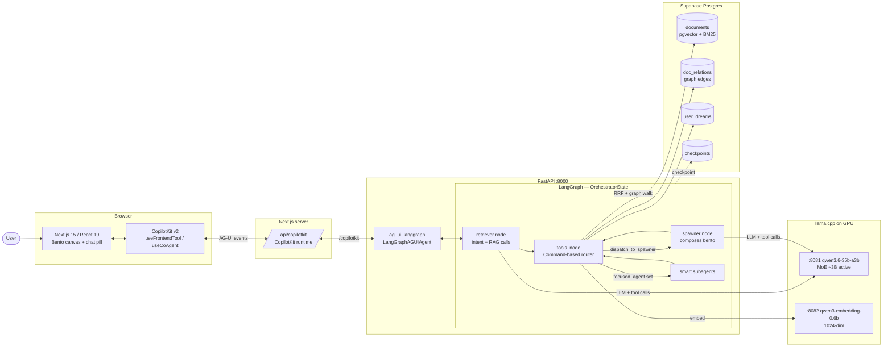
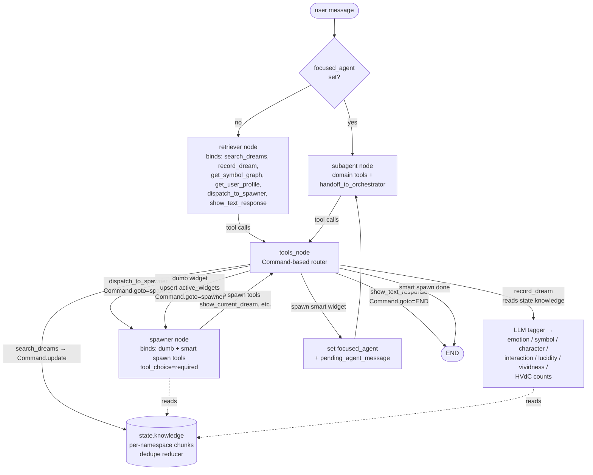
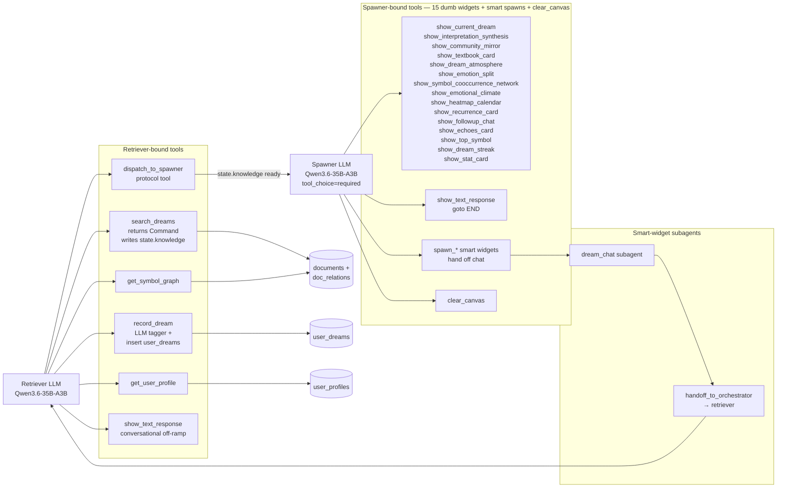

# DreamRAG — AI Dream Analysis with Dynamic Bento Dashboard

> CS 6120 NLP Final Project — Northeastern University, Khoury College
> **v4 — April 2026 — Retriever → Spawner split, fully local inference (zero cloud APIs)**

---

## Project Writeup — CS 6120 Proposal

*Gin Fu ([fu.jingyi2@northeastern.edu](mailto:fu.jingyi2@northeastern.edu)), Shiran Wang ([wang.shira@northeastern.edu](mailto:wang.shira@northeastern.edu))*
*Northeastern University, Khoury College of Computer Science — [github.com/blueif16/dreamrag](https://github.com/blueif16/dreamrag)*
*Full PDF: [`docs/CS6120_DreamRAG_Proposal.pdf`](docs/CS6120_DreamRAG_Proposal.pdf)*

### 1. Proposed Objective

DreamRAG helps people make sense of their own dream journals. Each query returns a bento-grid dashboard instead of a block of text, composed on the fly from three corpora: community narratives, dream-analysis literature, and the user's own journal. A self-correcting LangGraph agent drives the retrieval. We fuse BM25 and pgvector cosine scores using Reciprocal Rank Fusion, or RRF (Cormack et al., 2009), then expand the seed set by walking typed edges in a Supabase `doc_relations` table through a recursive CTE. The pipeline routes results to about a dozen widgets: interpretation synthesis, symbol graph, emotion radar, community mirror, heatmap, stat card. Each consumes a different slice of the retrieval output — raw chunks, SQL aggregates, or typed edges, depending on the widget — and each carries chunk-level provenance back to its source. So retrieval decides both what appears and how it gets rendered.

### 2. Background and Motivation

**Problem.** People who keep dream journals end up with years of rich longitudinal text. What they do not have is a scalable way to connect those entries to the frameworks that would make sense of them: Jung on symbols, Freud on latent content, the Hall/Van de Castle (HVdC) coding system, or Domhoff's continuity-hypothesis account. The same gap exists at the community level, where public datasets hold tens of thousands of dreams that nobody has cross-indexed against private archives. Current practice is manual symbol lookup and cross-referencing by hand. It does not scale. If it works, journalers get a reflective tool tied to the interpretive tradition, researchers can cross-reference private and public dream data at scale, and the pattern works in other domains where flat top-*k* is not enough.

**Why it is hard.** Single-pass RAG returns a flat top-*k* list. That is not enough here. Dream analysis wants multi-hop symbolic reasoning, cross-corpus triangulation, and temporal co-occurrence discovery inside one user's archive. It also wants provenance, because mixing clinical literature with personal journal data without traceability is a liability. The corpora themselves look nothing alike: informal first-person journals, terse HVdC codes, academic prose. And the matching is symbolic, not lexical. "Water" should reach Jung's "unconscious" through a typed edge, not through word overlap.

**Related literature.** The interpretive backbone comes from the Hall/Van de Castle manual ([dreams.ucsc.edu/Coding](https://dreams.ucsc.edu/Coding/)), Jung, Freud, and Domhoff (MIT Press, 2018). For NLP-scale precedent we look to *Our Dreams, Our Selves* (2020) and the Reddit r/Dreams topic-model study (Sanz et al., 2025). Technical foundations are RRF (Cormack et al., 2009), HNSW (Malkov & Yashunin, 2018), and Qwen3-Embedding (Zhang et al., 2025), whose instruction-prefixed query format we adopt.

**Data.** We only ingest community sources that come pre-annotated, so HVdC codes come from the source rather than from an LLM at ingest time. Unannotated variants like DreamBank/DReAMy-lib, SDDb, and Reddit r/Dreams are on hold until we have a runtime auto-tagger.

| Source | Scale | Annotations / notes |
|--------|-------|---------------------|
| **DreamBank Annotated** | ~28K reports | HVdC emotion + character codes (HF `gustavecortal/DreamBank-annotated`) |
| **Dryad HVdC-annotated** | ~20K reports | Full HVdC codes + numeric indices (Dryad `10.5061/dryad.qbzkh18fr`) |
| **Freud, Jung (Gutenberg)** | textbook | Chunked at 1500/200 |
| **HVdC coding manual** | reference | Scraped from dreams.ucsc.edu/Coding |

*Per-user Supabase entries are populated at runtime and auto-tagged only when source annotations are absent.*

### 3. Proposed Approach and Implementation

**Pre-processing.** Corpora come in through the `RAGStore` and `DataAdapter` components of the Supabase RAG scaffold. Academic texts chunk at 1500/200 tokens, the scraped HVdC manual at 1200/150. Dream narratives stay intact at report level. We parse HVdC codes and numeric indices directly from source CSV and TSV columns into metadata, so bulk ingest never calls an LLM. User-written journal entries, which ship with no source annotations, go through a planned 4B-class Qwen tagger. Edges come out of the same pass. In-archive symbol co-occurrences accumulate weight over repetition, and cross-corpus `similar_to` edges link personal entries to community and academic chunks.

**Retrieval algorithm.** Retrieval runs entirely in Supabase Postgres through the scaffold's *Context Mesh*. RRF fuses BM25 and pgvector cosine scores over `vector(1024)` HNSW embeddings into a seed set. A recursive CTE then walks that seed set outward along seven typed edges in `doc_relations`: `symbolizes`, `similar_to`, `co_occurs`, `follows`, `interprets`, `contradicts`, `coded_as`. The whole thing sits inside a self-correcting LangGraph: classify_query → plan_retrieval → retrieve → grade → rewrite_retry → synthesize.

**Widget composition.** The synthesize node emits layout JSON that maps retrieval results onto roughly fourteen widget types, each taking a different slice. Raw chunks drive the *Interpretation Synthesis* and *Textbook Card*. Typed edges drive the *Symbol Network* (`co_occurs`), *Dream Timeline* (`follows`), and *Community Mirror* (cross-corpus `similar_to`). SQL aggregates over `user_dreams` drive the *Heatmap*, *Emotion Radar*, and *Stat Card*. Composition rules keyed on query type pick which widgets appear and at what grid size, so the same query vocabulary yields structurally different dashboards depending on what was asked.

**Robustness.** The grade node runs an LLM relevance check that triggers a query rewrite on failure, using a different model family than the synthesizer to avoid self-preference bias. The three namespaces (`community_dreams`, `dream_knowledge`, `user_{uid}_dreams`) stay isolated at query time and each receives instruction-prefixed queries. Class imbalance is stark. Roughly 48K community reports against a much smaller textbook layer and per-user archives in the tens to hundreds. We handle it with stratified per-namespace budgets and HVdC frequency capping. Graph over-fitting is controlled by normalizing `co_occurs` weights by user entry count and validating on a held-out user split.

**Inference stack.** Everything runs locally on a GCP `g2-standard-8` with an NVIDIA L4 (24 GB VRAM). No cloud APIs in the serving path. Chat uses `unsloth/Qwen3.6-35B-A3B-GGUF:UD-IQ4_XS`, a MoE that activates about 3B parameters per token, so throughput tracks a dense 3B rather than a 35B. The freed VRAM lets us keep the KV cache at fp16 for 32K context, which matters because `q8_0` KV degrades long-context needle retrieval and tool-call argument fidelity. Both are load-bearing for the graph-hop RAG and the agent loop. A dense Qwen3.5-27B at Q4 stays available as a fallback. Embeddings use Qwen3-Embedding-0.6B (Q8_0, 1024-dim MRL, last-token pooling, L2-normalized), with the option to drop the query-time dimension to 768 or 512 if latency binds. HNSW on `vector(1024)` and GIN indexes on symbol and emotion tag arrays handle hybrid filtering. Namespace-scoped queries keep the recursive CTE bounded.

**Validation.** Evaluation answers four questions. *Does retrieval find the right dreams?* We compare the graph-expanded pipeline against BM25, pgvector, and plain RRF on 100 hand-labeled similar-dream pairs from DreamBank, which isolates what the graph layer adds. *Do the interpretations hold up?* Three raters score synthesized cards on a held-out slice of Dryad dreams the graph never saw during training. *Is the provenance honest?* We audit twenty dashboards by hand, checking that each widget's cited chunks actually support what it rendered. *And does any of this help real journalers?* We also track how much of a typical answer comes from graph hops rather than the first-pass seed set, which tells us whether the graph is doing real work. Operating targets are under two seconds to first token and under fifty milliseconds per embedding.

**Limitations.** Provenance guarantees retrieval traceability, not generator faithfulness, so a post-synthesis faithfulness check runs against the linked chunks. Cold-start users get seed-only layouts until their archive grows. Low-bit MoE quantization may degrade long-chain reasoning, which we probe by comparing UD-IQ4_XS against a higher-bit reference. Every corpus is English and Western-theory-dominated, which limits cross-cultural generalization. DreamRAG is a research prototype, not a clinical tool. Every interpretation card carries a disclaimer to that effect.

---

## Product Update — 2026-04-20

The agent is now a **two-node pipeline**: a **retriever** that classifies intent and populates `state.knowledge` via RAG calls, then hands off to a **spawner** that composes the bento dashboard from those chunks. Previously the orchestrator did both jobs in one prompt, which caused Qwen3.6 to either skip retrieval entirely or skip spawning — splitting the concerns fixed both failure modes.

### What changed since the March split-less orchestrator

- **Retriever / spawner split** (`frontend/backend/agent/graph.py`). The retriever sees only `search_dreams`, `record_dream`, `get_symbol_graph`, `get_user_profile`, `dispatch_to_spawner`, and the conversational `show_text_response` off-ramp. The spawner sees only dashboard spawn tools + non-retrieval backend tools. `dispatch_to_spawner` transitions between them. Each node gets a fresh minimal context — the spawner does **not** replay the retriever's tool-call log (context isolation).
- **`state.knowledge` reducer field** (`state.py`). `search_dreams` now returns `Command(update={"knowledge": {namespace: chunks}})` instead of dumping chunks into a `ToolMessage`. A custom merge reducer dedupes by chunk `id` across namespaces. The spawner reads `state.knowledge` directly; the retriever only gets a terse `{count, stored: true}` ack so chunk content never fills the retriever's context.
- **Dumb widgets are backend-registered tools**, not AG-UI frontend tools. `frontend/examples/dreams/widget_tools.py` exports 15 `StructuredTool` specs (`show_current_dream`, `show_interpretation_synthesis`, `show_text_response`, ...) bound to the spawner LLM. `tools_node` upserts directly into `active_widgets` — the 1-turn `_sync_dumb_widgets` delay is gone.
- **LLM dream tagger** (`examples/dreams/tools.py`). `record_dream` is now the last call in the new-dream flow: it reads `state.knowledge`, passes retrieved chunks into an LLM tagger, and produces structured fields (`emotion_tags`, `symbol_tags`, `character_tags`, `interaction_type`, `lucidity_score`, `vividness_score`, `hvdc_codes`). Regex keyword matching is a fallback only. Order matters — calling `record_dream` before search leaves every column empty.
- **Command-based routing**. `tools_node` always returns `langgraph.types.Command(update=..., goto=...)`. This replaces the previous conditional_edges on the tools node, which were fanning out into two concurrent branches (Command.goto + edge target) and producing duplicate `AIMessage`s the chat API rejected with HTTP 400.
- **Guardrails baked in** — a) retriever re-invokes with a nudge if the LLM tries `record_dream` / `dispatch_to_spawner` before any `search_dreams` ran; b) `tools_node` auto-fills `source_chunk_ids` with the top-3 chunks by similarity when the LLM passes `[]`; c) mid-dashboard `replace_all` is silently downgraded to `add` to prevent the spawner from wiping its own canvas; d) spawner binds tools with `tool_choice="required"` to stop Qwen from emitting multi-line "plan" prose instead of tool calls.
- **Cloud E2E tests** (`frontend/backend/tests/cloud_e2e/`). `pytest -m cloud_e2e` drives the real graph against the live L4 VM, asserting retriever→spawner ordering, spawner context isolation, and that `state.active_widgets` is non-empty. JSONL traces land in `runs/`.
- **New surfaces**: `/api/user-dreams` lists a user's dreams; `/showcase` is a widget gallery rendered with mock data for design review.
- **Live demo VM** pinned at `35.231.190.210` (frontend :3000, backend :8000, chat LLM :8081, embed :8082). L4-specific constraints unchanged (`-ub 128`, fp16 KV, chat-before-embed load order).

### System at a glance



### Retriever → Spawner lifecycle



**Context isolation**: the spawner does NOT replay the retriever's tool-call history. It receives only a fresh `SystemMessage` + a single `HumanMessage` with `user_msg`, the formatted `state.knowledge` blob, `Available chunk IDs: <per-namespace integer list>`, the retriever's optional `note`, and `Already-spawned widgets`. This keeps the spawner's context deterministic and stops Qwen from being distracted by retrieval scaffolding.

Smart widgets still own chat until they call `handoff_to_orchestrator` (which now routes back to the retriever).

### Tool landscape



### Pages & their responsibilities (current Next.js routes)

| Route | Role | Backend dependencies |
|-------|------|----------------------|
| `/` | Landing + 3D particle morph intro | Static; no backend |
| `/chat` | Dream capture + streaming analysis | `record_dream`, spawn widgets, focused subagents |
| `/dashboard` | Latest reading — bento canvas with interpretation, metrics, sources | `search_dreams`, `get_user_profile`, `get_symbol_graph`, widget stream |
| `/archive` | Historical workspace — browse / reopen prior dreams | `search_dreams` (user namespace), per-dream re-analysis |
| `/profile` | Long-term patterns — streaks, heatmap, top symbols, emotion distribution | `get_user_profile` (cached aggregates, recomputed on `record_dream`) |
| `/showcase` | Widget gallery — every dumb widget rendered with mock data for design review | None (static mocks) |
| `/api/user-dreams` | List a user's recent dreams (id, text, tags, scores, HVdC counts) | Supabase `user_dreams` direct |
| `/api/user-profile` | Cached aggregate profile consumed by self-contained widgets (`emotional_climate`, `recurrence_card`, `top_symbol`) | Supabase `user_profiles` cache |

Shared services: per-user Supabase ownership, async widget streaming via AG-UI `STATE_DELTA`, chunk-level provenance from `search_context_mesh` carried through `source_chunk_ids` on every widget.

### Live demo VM

- IP `35.231.190.210` (docker context `gcp-dreamrag`, `ssh://tk@35.231.190.210`)
- Frontend `:3000`, backend `:8000`, chat LLM `:8081/v1` (`qwen3.6-35b-a3b`), embed `:8082/v1` (`qwen3-embedding-0.6b`, 1024-dim)
- Firewall rule `dreamrag-llm-ports` opens 8081/8082 to `0.0.0.0/0` so `pytest -m cloud_e2e` and local dev can point at the VM directly

## 1. Vision

DreamRAG is a RAG system that turns dream journals into a living dashboard. Users type into a single chat input — the LLM retrieves from three knowledge layers (community dreams, academic literature, personal dream DB) and dynamically composes a full-page bento-grid of glassmorphic widget cards. The AI decides which widgets to render, their sizes, and their data. Every card carries **provenance links** back to the originating chunks.

This is not a static dashboard with a chat sidebar. The entire page IS the response.

---

## 2. Data Sources

### 2.1 Community Dream Corpus (~100K+ narratives)

| Source | Scale | Format | Access |
|--------|-------|--------|--------|
| **DreamBank** | ~27K reports | JSON | [DreamScrape GitHub](https://github.com/mattbierner/DreamScrape) |
| **DreamBank Annotated** | ~27K reports | HF dataset | [gustavecortal/DreamBank-annotated](https://huggingface.co/datasets/gustavecortal/DreamBank-annotated) — HVdC coded |
| **DReAMy-lib** | ~20K reports | HF dataset | [DReAMy-lib/DreamBank-dreams-en](https://huggingface.co/datasets/DReAMy-lib/DreamBank-dreams-en) |
| **SDDb** | ~45K reports + surveys | CSV | [Zenodo](https://doi.org/10.5281/zenodo.11662064) |
| **Reddit r/Dreams** | ~44K from 34K users | Scrape | Validated in EPJ Data Science 2025 — 217 topics / 22 themes |
| **Dryad Annotated** | ~20K reports | CSV | [Dryad](https://datadryad.org/dataset/doi:10.5061/dryad.qbzkh18fr) — HVdC NLP annotations |

### 2.2 Dream Analysis Knowledge Base (textbook layer)

| Source | Content |
|--------|---------|
| **Hall/Van de Castle Manual** | 10 categories of dream elements — [dreams.ucsc.edu/Coding](https://dreams.ucsc.edu/Coding/) |
| **Jungian Theory** | Jung's "Symbols and the Interpretation of Dreams" (public domain) |
| **Freudian Theory** | Freud's "The Interpretation of Dreams" (public domain) |
| **Domhoff Neurocognitive** | Continuity hypothesis, MIT Press |
| **NLP Dream Research** | "Our Dreams, Our Selves" (2020); Reddit dream content (2025) |

### 2.3 User's Personal Dreams (Supabase — structured + vector)

```sql
create table user_dreams (
  id bigint primary key generated always as identity,
  user_id uuid references auth.users(id),
  recorded_at timestamptz default now(),
  raw_text text not null,
  emotion_tags text[] default '{}',
  symbol_tags text[] default '{}',
  character_tags text[] default '{}',
  interaction_type text,
  lucidity_score float,
  vividness_score float,
  hvdc_codes jsonb default '{}',
  embedding vector(1024),
  created_at timestamptz default now()
);
create index on user_dreams using hnsw (embedding vector_cosine_ops);
create index on user_dreams using gin (symbol_tags);
create index on user_dreams using gin (emotion_tags);
```

---

## 3. Technical Stack

### 3.1 Pinned Versions (Critical)

| Package | Version | Why |
|---------|---------|-----|
| `copilotkit` | `==0.1.75` | Released 2026-01-09. v0.1.76 shipped 2 min later with broken `langchain.agents.middleware` import. 0.1.75 is the correct pin. |
| `langgraph` | `1.0.10` | Pulled by copilotkit, satisfies `>=0.3.25,<1.1.0` |
| `ag-ui-langgraph` | `0.0.27` | AG-UI protocol bridge |
| `ag-ui-protocol` | `0.1.14` | Wire protocol |
| `fastapi` | `0.115.14` | Satisfies `>=0.115.0,<0.116.0` |
| `langchain` | `1.2.10` | Core orchestration |
| `langchain-core` | `1.2.20` | Base abstractions |

**What 0.1.75 gives us (everything needed):** `CopilotKitSDK`, `LangGraphAgent`, `LangGraphAGUIAgent`, `CopilotKitState` / `emit_intermediate_state`, `add_fastapi_endpoint`. The only thing 0.1.76+ added was `CopilotKitMiddleware` — broken, unused.

### 3.2 Infrastructure — GCP Compute Engine (Fully Self-Hosted)

**Zero cloud APIs. Every model runs on our own GPU. Nothing leaves the box.**

```
+----------------------------------------------------------------------+
|  GCP Compute Engine (g2-standard-8, NVIDIA L4 24GB)                  |
|                                                                      |
|  +-------------+  +-------------+  +------------------------------+  |
|  | Next.js 15  |  | FastAPI     |  | llama.cpp  (llama-server)    |  |
|  | +CopilotKit |  | +LangGraph  |  |                              |  |
|  | :3000       |  | :8000       |  |  :8081 -> qwen3.6-35b-a3b    |  |
|  +------+------+  +------+------+  |  :8082 -> qwen3-embed-0.6b   |  |
|         | AG-UI          |         +---------------+--------------+  |
|         +-------+--------+                         | OpenAI-compat  |
|                 | Supabase SDK                     | API            |
|                 v                                                    |
|  +--------------------------------------------------------------+    |
|  |  Supabase Postgres (hosted)                                  |    |
|  |  documents (pgvector + BM25) | user_dreams                   |    |
|  |  doc_relations (graph)       | checkpoints                   |    |
|  +--------------------------------------------------------------+    |
+----------------------------------------------------------------------+
```

### 3.3 Models (All Local via llama.cpp)

Single chat model (MoE) + single embedding model, both containerised via llama.cpp's prebuilt CUDA image. Models are pulled from Hugging Face on first boot into a shared `hf-cache` volume, so there is no manual download step.

| Role | Model | GGUF Quant | VRAM | Why |
|------|-------|-----------|------|-----|
| **Chat / Orchestration** | `unsloth/Qwen3.6-35B-A3B-GGUF` | `UD-IQ4_XS` (~17.7 GB) | ~20 GB w/ 32K fp16 KV | MoE — 35B total, ~3B active per token. IQ4_XS matches Q4_K_M quality within noise, costs ~4.7 GB less than UD-Q4_K_XL, and leaves headroom for fp16 KV + CUDA context. fp16 KV (not q8_0) preserves long-context needle retrieval and tool-call argument fidelity — critical for agentic RAG. |
| **Embeddings** | `Qwen/Qwen3-Embedding-0.6B-GGUF` | `Q8_0` (~0.7 GB) | ~1 GB on GPU | SOTA MTEB for its class. Instruction-aware. MRL support — 1024 dims default, reducible to 768/512. Decoder-only with last-token (EOS) pooling. |

**VRAM Budget (NVIDIA L4, 24 GB):**

| Config | Chat weights | KV @ 32K fp16 | Embed | Slack | Fits |
|--------|--------------|---------------|-------|-------|------|
| chat IQ4_XS + embed Q8 (default) | 17.7 GB | ~3 GB | 1 GB | ~2 GB | yes |
| chat IQ4_XS + embed Q8 + `--parallel 2` | 17.7 GB | ~3 GB × 2 slots (share budget) | 1 GB | tight | maybe — drop `-c` to 24 K |
| chat only (no embed on GPU) | 17.7 GB | ~3 GB | — | ~3 GB | yes |

**Realistic throughput on L4** (~300 GB/s memory bandwidth, ~30 TFLOPS fp16 — **not** a 3090/4090):

- Decode: 30–50 tok/s (community 4090 numbers of ~120 tok/s do **not** port).
- Prefill: ~2–4 s for a 4K prompt. Mitigated by `--slot-save-path` + `--cache-reuse 256` so shared system prompts are reused across requests.

### 3.4 llama.cpp Server Configuration

Both models run via `llama-server` inside `ghcr.io/ggml-org/llama.cpp:server-cuda` with an OpenAI-compatible API. Exact flags live in `docker-compose.yml`; the equivalent bare-metal commands:

```bash
# Chat — qwen3.6-35b-a3b (primary)
llama-server \
  -hf unsloth/Qwen3.6-35B-A3B-GGUF:UD-IQ4_XS \
  --host 0.0.0.0 --port 8081 \
  --alias qwen3.6-35b-a3b \
  -ngl 99 -fa on \
  -c 32768 --parallel 1 \
  -ctk f16 -ctv f16 \
  -b 2048 -ub 512 \
  --slot-save-path /var/cache/llama/slots \
  --cache-reuse 256 \
  --temp 0.7 --top-p 0.8 --top-k 20 --min-p 0.0 \
  --chat-template-kwargs '{"enable_thinking":false}' \
  --metrics

# Embedding — qwen3-embedding-0.6b
llama-server \
  -hf Qwen/Qwen3-Embedding-0.6B-GGUF:Q8_0 \
  --host 0.0.0.0 --port 8082 \
  --alias qwen3-embedding-0.6b \
  --embedding --pooling last --embd-normalize 2 \
  -ngl 99 -ub 512
```

**Why these flags:**

- `-fa on` + `-ngl 99` — flash attention, full GPU offload.
- `-c 32768 --parallel 1` — 32K context, single slot. `-c` is **total** KV budget; raising `--parallel` splits it.
- `-ctk f16 -ctv f16` — fp16 KV. `q8_0` KV saves ~1.5 GB but measurably hurts long-context recall and tool-arg fidelity; only flip to q8 if you need ≥128K context.
- `-b 2048 -ub 512` — physical / micro batch sizes tuned for L4 prefill throughput.
- `--slot-save-path` + `--cache-reuse 256` — persist KV prefixes across requests. Huge win for the DreamRAG orchestrator, which re-sends the same system prompt every turn.
- `--chat-template-kwargs '{"enable_thinking":false}'` — Unsloth's recommended non-thinking setting for Qwen3.6 chat workloads. For coding/precise tasks, flip to thinking mode with `temp=0.6 top_p=0.95`.
- Embedding `--pooling last --embd-normalize 2` — required for Qwen3-Embedding (decoder-only EOS pooling) and for cosine similarity in pgvector.

**Tuning rules of thumb:**

- OOM? Drop `-c` before dropping quant. 32K → 16K saves ~1.5 GB.
- Gibberish at long context on certain drivers? Try `-ctk bf16 -ctv bf16`.
- Need huge (128K+) context? Flip `-ctk q8_0 -ctv q8_0` — quality hit is only on deep-recall.
- Do **not** use `--n-cpu-moe`. `g2-standard-8` has 32 GB RAM and PCIe 4.0 x16 — MoE expert offload only helps when you have 128+ GB RAM and want a bigger model.

**Qwen3-Embedding note:** These models use decoder-only architecture with last-token pooling. The `<|endoftext|>` token aggregates the full sequence meaning. Instruction-aware — prefix queries with task instructions for 1-5% improvement:

```
Instruct: Given a dream journal entry, retrieve similar dream narratives
Query: I was flying over a dark ocean and felt peaceful
```

### 3.5 LangChain Integration with llama.cpp

```python
from langchain_openai import ChatOpenAI, OpenAIEmbeddings

# Chat — points at llama-server on :8081 (in-compose hostname: chat-model)
llm = ChatOpenAI(
    base_url="http://chat-model:8081/v1",  # or http://localhost:8081/v1 outside compose
    api_key="not-needed",
    model="qwen3.6-35b-a3b",
    temperature=0.7,
)

# Embeddings — points at llama-server on :8082 (in-compose hostname: embed-model)
embeddings = OpenAIEmbeddings(
    base_url="http://embed-model:8082/v1",
    api_key="not-needed",
    model="qwen3-embedding-0.6b",
    dimensions=1024,  # MRL: can reduce to 768 or 512 if needed
)
```

### 3.6 Reference Scaffolds

| Scaffold | What We Use | Reference |
|----------|-------------|-----------|
| **Supabase RAG Scaffold** | `RAGStore`, `DataAdapter`, pgvector schema, `search_context_mesh` RRF+Graph SQL, namespace isolation, `doc_relations`, ingestion patterns | `SPECIFICATION.md` + `docs/v1_guide.md` |
| **CopilotKit + LangGraph Scaffold** | `CopilotKitSDK` + `LangGraphAGUIAgent`, `add_fastapi_endpoint`, `useCoAgent` state sync, AG-UI streaming | `README.md` in CopilotKit scaffold |

---

## 4. RAG Architecture (Supabase-Native)

All retrieval in a single Supabase Postgres via the RAG Scaffold's "Context Mesh": RRF (BM25 + pgvector) -> graph traversal via `doc_relations`.

### 4.1 Namespaces

| Namespace | Content |
|-----------|---------|
| `community_dreams` | 100K+ dream narratives from DreamBank, SDDb, Reddit, Dryad |
| `dream_knowledge` | Textbook/academic chunks — Jung, Freud, Domhoff, HVdC manual |
| `user_{uid}_dreams` | Personal entries (also in `user_dreams` table for SQL) |

### 4.2 What the Graph Layer Enables (Beyond Basic Vector Search)

The `doc_relations` table + recursive CTE graph walk is what separates this from a naive "embed and retrieve" system. Specific capabilities the graph unlocks for dream analysis:

**Multi-hop symbolic reasoning.** A user asks "what does water mean in my dreams?" -> vector search finds their water dreams -> graph edges (`symbolizes`, `associated_with`) walk from the water-dream chunks to Jungian "unconscious" concepts, to Freudian "birth/womb" interpretations, to HVdC coding norms for water elements -> all arrive in a single context window without separate queries.

**Cross-corpus triangulation.** Edges link a user's personal dream chunk to the most similar community dream (via `similar_to` edges built during ingestion), which is itself linked to an academic interpretation chunk. The synthesize node can now say "your dream mirrors a common pattern documented in DreamBank, which Jung would interpret as..." — with provenance for each hop.

**Temporal pattern discovery.** Edges of type `follows`, `recurs_with`, and `co_occurs` between a user's own dream entries let the graph surface patterns that vector similarity alone misses: "water appears in your dreams every time flying also appears, and this co-occurrence has increased over the last 3 months."

**Supernode pruning.** Generic symbols like "house" or "person" connect to thousands of nodes. The `properties->>'is_generic'` flag and the 0.8x score decay per hop prevent these from flooding the context with irrelevant neighbors. Only high-weight, specific edges survive the walk.

**Edge types used in DreamRAG:**

| Edge Type | Connects | Example |
|-----------|----------|---------|
| `symbolizes` | dream element -> academic concept | water_chunk -> unconscious_jungian |
| `similar_to` | dream -> dream (cross-corpus) | user_dream_42 -> dreambank_1337 |
| `co_occurs` | symbol -> symbol (within user's corpus) | water -> flying (weight: 0.73) |
| `follows` | dream -> dream (temporal) | user_dream_41 -> user_dream_42 |
| `interprets` | academic chunk -> academic chunk | jung_water -> freud_water |
| `contradicts` | academic chunk -> academic chunk | continuity_hypothesis -> activation_synthesis |
| `coded_as` | dream element -> HVdC category | aggressive_interaction -> A/H code |

### 4.3 Retrieval Flow (Retriever → Spawner split)

```
User query -> retriever node:
  1. classify intent in-prompt (A: new dream / B: symbol / C: temporal / conversational)
  2. issue search_dreams(..) per namespace — each returns Command(update=state.knowledge)
  3. (Flow A only) record_dream LAST — LLM tagger reads state.knowledge for context
  4. dispatch_to_spawner(note?) OR show_text_response(msg) for short conversational replies

-> tools_node (Command-routed):
  - search_dreams / get_symbol_graph / get_user_profile → merge into state.knowledge (reducer dedupes by id)
  - record_dream → LLM tagger → insert user_dreams row → recompute cached profile
  - dispatch_to_spawner → Command(goto="spawner")
  - show_text_response → Command(goto=END)
  - auto-fill source_chunk_ids with top-3 by similarity if LLM passes []

-> spawner node:
  5. receives fresh System + single Human with user_msg + formatted state.knowledge
     + explicit per-namespace chunk id list + retriever note + Already-spawned widgets
  6. emits dumb widget spawn tool calls per flow (replace_all → add → add → ...)
  7. terminates with show_text_response("Dashboard ready.") when flow is complete
```

Provenance, chunk registry, and graph-hop metadata are unchanged — the spawner carries `source_chunk_ids` on every widget it emits.

### 4.4 Ingestion (via RAG Scaffold)

```python
from app.core import RAGStore, DataAdapter

rag = RAGStore(namespace="community_dreams")
chunks = DataAdapter.from_json_file("dreambank.json", content_field="content")
rag.ingest_batch(chunks, source="dreambank")

rag_kb = RAGStore(namespace="dream_knowledge")
chunks = DataAdapter.from_text_chunks(jung_text, chunk_size=1500, chunk_overlap=200)
rag_kb.ingest_batch(chunks, source="jung_symbols")

# Graph edges — this is where the scaffold's graph layer pays off
rag_kb.add_relation(water_id, unconscious_id, "symbolizes", properties={"weight": 0.9})
rag_kb.add_relation(water_id, birth_id, "symbolizes", properties={"weight": 0.7, "theory": "freudian"})
rag_kb.add_relation(jung_water_id, freud_water_id, "contradicts", properties={"weight": 0.6})
```

**Automated edge extraction during ingestion:**

```python
# After ingesting a user dream, auto-extract symbol co-occurrences
symbols = tagger_llm.invoke(f"Extract symbols from: {dream_text}")  # -> ["water", "flying", "dark"]
for pair in combinations(symbols, 2):
    existing = rag.get_relation(pair[0]_chunk_id, pair[1]_chunk_id, "co_occurs")
    if existing:
        new_weight = min(existing.weight + 0.1, 1.0)  # strengthen on repetition
        rag.update_relation(existing.id, properties={"weight": new_weight})
    else:
        rag.add_relation(pair[0]_chunk_id, pair[1]_chunk_id, "co_occurs", properties={"weight": 0.3})
```

### 4.5 Embedding Dimension Update

The schema uses **`vector(1024)`** to match `qwen3-embedding-0.6b`'s native max dimension. This model supports MRL (Matryoshka Representation Learning), so we can reduce to 768 or 512 at query time if latency matters — but 1024 is the default for maximum retrieval quality.

All previous references to `vector(768)` in the scaffold SQL must be updated to `vector(1024)`.

---

## 5. Chunk Provenance — Every Card Links to Sources

Hard requirement. Every widget card carries provenance metadata linking to the exact chunks that populated it.

### 5.1 Agent State (Backend — `frontend/backend/agent/state.py`)

```python
class OrchestratorState(CopilotKitState):
    active_widgets: List[ActiveWidget] = []       # [{id, type: "dumb"|"smart", props}]
    focused_agent: Optional[str] = None           # which smart subagent owns chat
    widget_state: Dict[str, Any] = {}             # live state for focused smart widget
    widget_summaries: Dict[str, str] = {}         # summaries keyed by past focused widget
    pending_agent_message: Optional[str] = None   # intro injected on subagent first turn
    # Retrieval bucket — populated by search_dreams / get_symbol_graph / get_user_profile
    # via Command.update. Custom reducer (merge_knowledge) dedupes by chunk id across calls.
    knowledge: Annotated[Dict[str, List[dict]], merge_knowledge] = {}
    note: Optional[str] = None                    # retriever → spawner one-line hint
```

Every chunk returned by `search_context_mesh` carries its unique integer `id`, similarity score, source namespace, and graph-hop metadata. The spawner receives the full chunk list in `state.knowledge` and stamps every widget with `source_chunk_ids`. `tools_node` auto-fills `source_chunk_ids` with the top-3 chunks by similarity when the LLM passes `[]` so provenance never silently drops.

### 5.2 Frontend: Source Drawer (via CopilotKit `useCoAgent`)

```typescript
const { state } = useCoAgent<DreamAgentState>({
  name: "dream_agent",
  initialState: { widgets: [], chunk_registry: {} },
});
```

Every widget component receives this interface:

```typescript
interface WidgetProps {
  type: string;
  content: Record<string, any>;
  col_span: number;
  row_span: number;
  source_chunks: string[];              // chunk IDs for this card
  chunk_registry: Record<string, {      // full lookup table
    content: string;       // preview (~200 chars)
    full_content: string;  // complete chunk text
    source: string;        // "dreambank" | "jung_symbols" | "user_journal"
    namespace: string;
    score: number;
    depth: number;         // 0 = seed, 1+ = graph hop
    source_type: string;   // "seed" | "symbolizes" | "co_occurs" | etc.
    type: "seed" | "graph_traversed";
  }>;
}
```

Every card has a small **"N sources"** link at the bottom. Clicking it expands a drawer showing chunk previews, source DB name, graph hop distance, edge type, and relevance score. Non-negotiable — the user must always be able to trace any insight back to its origin.

---

## 6. Widget Catalog

| Widget | Source | Description | Size |
|--------|--------|-------------|------|
| **Interpretation Synthesis** | All 3 | Rich text, multi-source analysis. Inline source badges per paragraph. | 2col tall |
| **Dream Frequency Timeline** | Personal SQL | Area chart over time. Lucid markers as glowing dots. | 2col |
| **Emotion Radar** | Personal SQL | Spider chart, 6 axes. Ghost line for previous period. | 1col tall |
| **Symbol Co-occurrence Network** | Personal SQL + Graph | Force-directed bubble graph. Built from `co_occurs` edges in `doc_relations`. Central symbol + connected nodes with edge weights as line thickness. | Full width |
| **Community Mirror** | `community_dreams` | 3-4 anonymized snippets + emotion tags + similarity %. Populated via `similar_to` graph edges. | 1col |
| **Textbook Card** | `dream_knowledge` | Authoritative excerpt, serif type, source citation. Reached via `symbolizes` / `interprets` graph edges. | 1col |
| **Heatmap Calendar** | Personal SQL | GitHub-style grid, colored by dominant emotion. | 2col |
| **Stat Card** | Personal + baseline | Bold metric + population comparison from DreamBank norms. | Small |
| **Lucidity Gauge** | Personal SQL | Radial ring + trend arrow. | Small |
| **Vividness Score** | Personal SQL | Large number + sparkline. | Small |
| **Emotion Split** | Personal SQL | Two donuts: symbol-specific vs overall emotion distribution. | 1col |
| **Top Symbols Bar** | Personal SQL | Horizontal bars, top N symbols. | 1col |
| **Vertical Dream Timeline** | Personal SQL + Graph | Date nodes + excerpts + emotion dots. `follows` edges power the sequence. | 1col tall |
| **Monthly Insight** | All 3 | LLM-generated summary of patterns and shifts. | 1col |

### Composition Rules

**Symbol queries** -> Interpretation (hero) + Textbook + Community Mirror + stat + co-occurrence + emotion split. 4-6 cards.

**Temporal queries** -> Frequency Timeline + Radar + Heatmap + Top Symbols + Lucidity + Vividness + Insight. 6-8 cards.

**Similarity queries** -> Community Mirror (expanded) + population stat + Textbook. 3-4 cards.

**New entry** -> Interpretation + Textbook + Community Mirror + streak stat. 3-4 cards.

---

## 7. UI Design

**Theme:** Light only. Ethereal quiet luxury. Meditation app x Bloomberg.

**Background:** Pale lavender (#EEEAFF) -> warm cream (#FFF9F2), blurred aurora blobs.

**Cards:** Glassmorphism — 55-65% white opacity, `backdrop-filter: blur(16px)`, 20px radius, thin white border, soft shadow, 12px gaps.

**Type:** Playfair Display (headings) + Satoshi (body). Line-height 1.6.

**Palette:** Lavender, muted indigo (#5B6EAF), dusty rose (#C4899C), cream, gold (#D4A853). Gradients: indigo-to-violet.

**Chat:** Frosted pill, bottom-center, "Ask about your dreams...", indigo send button.

**Layout engine:** CopilotKit state delivers layout JSON from LangGraph -> frontend renders as CSS Grid with staggered card reveals.

---

## 8. Project Structure

```
dreamrag/
+-- docker-compose.yml
+-- supabase/
|   +-- migrations/
|       +-- 001_rag_schema.sql          # documents + doc_relations + search_context_mesh() [vector(1024)]
|       +-- 002_user_dreams.sql         # user_dreams table [vector(1024)]
|       +-- 003_checkpoints.sql         # LangGraph PostgresSaver
|       +-- 004_debug_functions.sql     # debug_bm25_search, debug_rrf_fusion, etc.
+-- models/                             # (optional) bind-mount target; default flow uses HF cache volume
|   +-- Qwen3.6-35B-A3B-GGUF/UD-IQ4_XS.gguf
|   +-- Qwen3-Embedding-0.6B-GGUF/Q8_0.gguf
+-- backend/
|   +-- Dockerfile
|   +-- pyproject.toml                  # copilotkit==0.1.75, langgraph, fastapi
|   +-- app/
|       +-- main.py                     # FastAPI + add_fastapi_endpoint
|       +-- core/                       # from Supabase RAG Scaffold
|       |   +-- rag_store.py            # updated: uses local llama.cpp embeddings
|       |   +-- qwen_embeddings.py      # OpenAI-compat wrapper -> localhost:8082
|       |   +-- tool_factory.py
|       |   +-- adapters.py
|       +-- graph/                      # pattern from CopilotKit Scaffold
|       |   +-- state.py                # DreamAgentState (chunk_registry w/ graph depth)
|       |   +-- nodes.py                # classify, retrieve, grade, rewrite, synthesize
|       |   +-- edges.py
|       |   +-- workflow.py             # StateGraph + PostgresSaver
|       +-- ingestion/
|       |   +-- dreambank_loader.py
|       |   +-- sddb_loader.py
|       |   +-- reddit_loader.py
|       |   +-- textbook_loader.py
|       |   +-- auto_tagger.py          # qwen3.5-4b HVdC annotation via :8083
|       |   +-- edge_builder.py         # automated co_occurs / similar_to extraction
|       +-- widgets/
|           +-- catalog.py              # Widget types + composition rules
+-- frontend/
|   +-- package.json                    # next 15, react 19, copilotkit, recharts, d3
|   +-- src/
|       +-- app/
|       |   +-- api/copilotkit/         # Runtime endpoint proxy
|       |   +-- layout.tsx              # CopilotKit provider
|       |   +-- page.tsx                # Bento grid + chat input
|       +-- components/
|       |   +-- BentoGrid.tsx
|       |   +-- GlassCard.tsx           # Glassmorphic wrapper + SourceDrawer
|       |   +-- ChatInput.tsx
|       |   +-- SourceDrawer.tsx        # Chunk provenance panel (shows graph hops)
|       |   +-- widgets/               # 14 widget components
|       +-- hooks/
|           +-- useDreamAgent.ts        # useCoAgent<DreamAgentState>
+-- scripts/
    +-- ingest_all.py
    +-- build_graph_edges.py            # batch edge extraction after initial ingest
    +-- setup_llama_cpp.sh              # build llama.cpp from source, download GGUFs
    +-- deploy_gcp.sh
```

---

## 9. Deployment (GCP Compute Engine — Docker Compose, Zero Source Builds)

Everything ships as containers. No building llama.cpp, no systemd units. The compose file at the repo root orchestrates `chat-model`, `embed-model`, `backend`, and `frontend`. Models are auto-downloaded from Hugging Face into a named volume (`hf-cache`) on first boot.

### 9.1 Provision the VM

```bash
# Create VM (L4 24GB, 200GB disk — enough for UD-IQ4_XS (~18GB) + embed (~0.7GB) + buffer)
gcloud compute instances create dreamrag-vm \
  --machine-type=g2-standard-8 --zone=us-central1-a \
  --boot-disk-size=200GB --boot-disk-type=pd-balanced \
  --accelerator=type=nvidia-l4,count=1 \
  --maintenance-policy=TERMINATE \
  --image-family=debian-12 --image-project=debian-cloud \
  --metadata=install-nvidia-driver=True \
  --tags=http-server,https-server

# Firewall for frontend (3000) and backend health checks (8000)
gcloud compute firewall-rules create dreamrag-web \
  --allow=tcp:3000,tcp:8000 --target-tags=http-server
```

### 9.2 One-time VM Bootstrap (SSH into the VM)

```bash
gcloud compute ssh dreamrag-vm --zone=us-central1-a

# Docker + NVIDIA Container Toolkit
curl -fsSL https://get.docker.com | sh
sudo usermod -aG docker $USER && newgrp docker
distribution=$(. /etc/os-release; echo $ID$VERSION_ID)
curl -fsSL https://nvidia.github.io/libnvidia-container/gpgkey \
  | sudo gpg --dearmor -o /usr/share/keyrings/nvidia-container-toolkit-keyring.gpg
curl -s -L https://nvidia.github.io/libnvidia-container/stable/deb/nvidia-container-toolkit.list \
  | sed 's#deb https://#deb [signed-by=/usr/share/keyrings/nvidia-container-toolkit-keyring.gpg] https://#g' \
  | sudo tee /etc/apt/sources.list.d/nvidia-container-toolkit.list
sudo apt-get update && sudo apt-get install -y nvidia-container-toolkit
sudo nvidia-ctk runtime configure --runtime=docker
sudo systemctl restart docker

# Sanity — must print a GPU row:
docker run --rm --gpus all nvidia/cuda:12.4.0-base-ubuntu22.04 nvidia-smi
```

### 9.3 Deploy the Stack (from your laptop)

```bash
# One-time — point local Docker at the VM over SSH
docker context create gcp-dreamrag --docker host=ssh://USER@GCP_VM_IP
docker context use gcp-dreamrag

# Bring everything up (first run: ~5–10 min to pull GGUFs into hf-cache volume)
docker compose up -d --build
docker compose logs -f chat-model   # wait for "server is listening on http://0.0.0.0:8081"

# Ingest (one-time, runs against the in-VM embed-model)
docker compose exec backend python scripts/ingest.py

# Smoke the chat endpoint
curl http://GCP_VM_IP:3000           # frontend
curl http://GCP_VM_IP:8000/healthz   # backend
```

See §10.1 (Automated Test Flow) for the end-to-end verification script.

---

## 10. Evaluation

**Retrieval:** Precision@5 / Recall@5 against curated DreamBank similar-dream pairs. Compare RRF-only vs RRF+Graph to quantify graph layer value.

**Graph impact:** Measure how many synthesis widgets include graph-traversed chunks (depth > 0) vs seed-only. Target: >=40% of Interpretation Synthesis content comes from graph hops.

**Interpretation:** Likert scale vs HVdC expert annotations on Dryad set.

**Provenance:** Sample 50 cards — verify linked chunks actually support rendered content. Check that graph hop metadata (edge type, depth) is accurate.

**Composition:** A/B static dashboard vs dynamic LLM-composed layout.

**E2E:** 10-15 users journal for 2 weeks, survey on insight quality + provenance usefulness.

**Inference latency:** Benchmark llama.cpp throughput on L4 — target <2s first token for chat, <50ms per embedding.

---

### 10.1 Automated Test Flow (Demo-Day Smoke)

Run this from your laptop after `docker compose up -d` on the VM. No human judgment required — every step exits non-zero on failure. Save as `scripts/smoke_gcp.sh`:

```bash
#!/usr/bin/env bash
set -euo pipefail
VM="${1:?usage: smoke_gcp.sh <GCP_VM_IP>}"

echo "[1/6] chat-model /health"
curl -fsS "http://$VM:8081/health" | grep -q '"status":"ok"'

echo "[2/6] embed-model /health"
curl -fsS "http://$VM:8082/health" | grep -q '"status":"ok"'

echo "[3/6] chat completion (tool-arg fidelity)"
curl -fsS "http://$VM:8081/v1/chat/completions" \
  -H 'Content-Type: application/json' \
  -d '{"model":"qwen3.6-35b-a3b","messages":[{"role":"user","content":"Reply with exactly the JSON: {\"ok\":true}"}],"temperature":0,"max_tokens":32}' \
  | python3 -c 'import sys,json; r=json.load(sys.stdin); c=r["choices"][0]["message"]["content"]; assert "\"ok\":true" in c.replace(" ",""), c; print("ok:", c)'

echo "[4/6] embedding shape = 1024"
curl -fsS "http://$VM:8082/v1/embeddings" \
  -H 'Content-Type: application/json' \
  -d '{"model":"qwen3-embedding-0.6b","input":"a dream of flying over water"}' \
  | python3 -c 'import sys,json; v=json.load(sys.stdin)["data"][0]["embedding"]; assert len(v)==1024, len(v); print("dim:", len(v))'

echo "[5/6] backend /copilotkit reachable"
curl -fsS -o /dev/null -w '%{http_code}\n' "http://$VM:8000/copilotkit" | grep -qE '^(200|405)$'

echo "[6/6] end-to-end agent turn (records a dream, expects widget spawn)"
python3 scripts/smoke_agent.py --host "$VM"
echo "ALL GREEN"
```

`scripts/smoke_agent.py` posts one turn through the CopilotKit runtime and asserts that the AG-UI stream contains at least one `TOOL_CALL_START` for a spawn tool and one `STATE_DELTA` setting `active_widgets`. That single call exercises: frontend→backend routing, LangGraph orchestrator, tool binding, llama.cpp tool-call generation, `search_dreams` pgvector hop, `record_dream` Supabase write, and widget state streaming. If it passes, demo-day works.

**Latency budget check (fail demo if exceeded):**

```bash
docker compose exec backend python - <<'PY'
import time, httpx
t=time.time(); r=httpx.post("http://chat-model:8081/v1/chat/completions",
  json={"model":"qwen3.6-35b-a3b","messages":[{"role":"user","content":"hi"}],"max_tokens":1},timeout=60)
print(f"TTFT ~{(time.time()-t)*1000:.0f}ms"); assert r.status_code==200
PY
```

Expect 1.5–3 s cold (first request triggers prefill + CUDA graph warmup), 300–800 ms warm. If cold >8 s or warm >1.5 s, something is offloading to CPU — check `nvidia-smi` and `docker compose logs chat-model | grep offloaded`.
