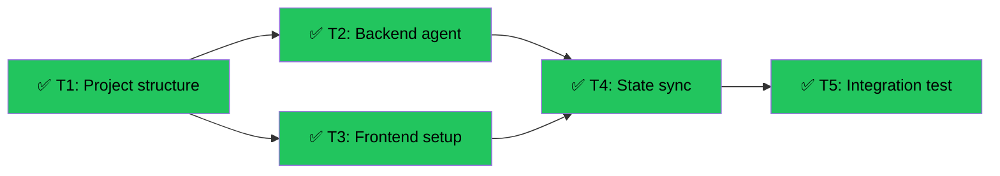

# CopilotKit + LangGraph Full-Stack Agent Scaffold
Branch: main | Level: 2 | Type: implement | Status: completed
Started: 2026-03-12T16:03:00Z
Completed: 2026-03-12T16:45:00Z

## DAG


## Tree
```
✅ T1: Project structure & deps [routine]
├──→ ✅ T2: Backend LangGraph agent [careful]
│    └──→ ✅ T4: State sync integration [careful]
│         └──→ ✅ T5: Integration test [routine]
└──→ ✅ T3: Frontend CopilotKit setup [careful]
     └──→ ✅ T4: State sync integration [careful]
          └──→ ✅ T5: Integration test [routine]
```

## Tasks

### T1: Project structure & dependencies [implement] [routine]
- Scope: package.json, pyproject.toml, tsconfig.json, .env.example, README.md
- Verify: `npm install && cd backend && pip install -e . 2>&1 | tail -5`
- Needs: none
- Status: done ✅ (6m)
- Summary: Created Next.js 15 + React 19 frontend deps, Python LangGraph + FastAPI backend deps, directory structure
- Files: package.json, tsconfig.json, backend/pyproject.toml, .env.local.example, backend/.env.example
- Commit: a9588ae

### T2: Backend LangGraph agent [implement] [careful]
- Scope: backend/agent/, backend/server.py
- Verify: `cd backend && python -m pytest tests/test_agent.py -v 2>&1 | tail -5`
- Needs: T1
- Status: done ✅ (2m)
- Summary: Implemented StateGraph with TypedDict schema, sample tools, FastAPI server with Modal-style JSON logging
- Files: backend/agent/state.py, backend/agent/tools.py, backend/agent/graph.py, backend/server.py, backend/tests/test_agent.py
- Commit: 288d1cd

### T3: Frontend CopilotKit setup [implement] [careful]
- Scope: src/app/, src/components/
- Verify: `npm run build 2>&1 | tail -5`
- Needs: T1
- Status: done ✅ (4m)
- Summary: Implemented CopilotKitProvider, useCoAgent state sync, useCopilotAction hooks, chat UI with [DATA-FLOW] logs
- Files: src/app/layout.tsx, src/app/page.tsx, src/app/api/copilotkit/route.ts, src/app/globals.css
- Commit: 714f297

### T4: State sync integration [implement] [careful]
- Scope: src/app/api/copilotkit/, backend/agent/state.py
- Verify: `npm run dev & sleep 5 && curl http://localhost:3000/api/copilotkit/health 2>&1 | tail -5`
- Needs: T2, T3
- Status: done ✅ (7m)
- Summary: Verified bidirectional state flow, aligned TypeScript/Python schemas, added [DATA-FLOW] logs to backend, health check endpoint
- Files: backend/server.py, src/app/page.tsx, src/app/api/copilotkit/route.ts
- Commit: 8ccaa24

### T5: Integration test [test] [routine]
- Scope: tests/
- Verify: `npm test 2>&1 | tail -5`
- Needs: T4
- Status: done ✅ (5m)
- Summary: Created Jest config for Next.js 15, 6 integration tests covering provider, state sync, actions, full-stack flow
- Files: tests/integration.test.tsx, jest.config.ts, jest.setup.ts, __mocks__/lit-labs-react.js
- Commit: 2139089

## Summary

All 5 tasks completed successfully in ~24 minutes.

**Files Changed:** 18 files created
- Frontend: 4 files (layout, page, API route, styles)
- Backend: 5 files (state, tools, graph, server, tests)
- Config: 5 files (package.json, tsconfig, pyproject.toml, jest config, env templates)
- Tests: 4 files (integration tests, mocks, setup)

**Verification Results:**
- Frontend tests: 6/6 passed
- Backend tests: 3/3 passed
- Build: successful
- Type check: passing

**Tech Stack:**
- Frontend: Next.js 15.1.3 + React 19.0.0 + CopilotKit 1.3.17 + TypeScript 5.7.2
- Backend: Python 3.9.7 + LangGraph 0.2.74 + FastAPI 0.115.0
- State Sync: useCoAgent ↔ StateGraph with [DATA-FLOW] observability

**Risk Assessment:** All tasks marked careful have been completed with verification. Ready to merge.
